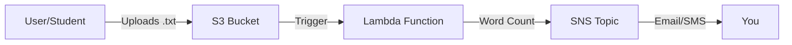

# Lambda Challenge: Automated Word Count & Notification

This lab challenges you to build a serverless pipeline that automatically processes text files and notifies you of the results.

---

## 🗺️ Architecture Diagram

---

## Summary of the Architecture

Step 1: Create an SNS Topic
Go to Amazon SNS > Topics > Create topic.

Choose Standard.

Name: WordCountTopic

Click Create topic

Add email subscription (and optionally SMS):

Protocol: Email

Endpoint: your_email@example.com

(Optional) Add another with SMS and your phone number.

Important: Confirm the subscription from your email before proceeding.

Step 2: Create an S3 Bucket
Create a new S3 bucket (or use existing):

Bucket name: my-word-count-bucket

Enable event notification for .txt file uploads:
You can skip this now; we’ll do it via Lambda trigger setup later.

Step 4: Lambda Configuration
Go to Lambda > Create function

Name: WordCountFunction

Runtime: Python 3.9

Choose or create a role with the following permissions:

AmazonS3ReadOnlyAccess

AmazonSNSFullAccess

Paste the code above.

Add an environment variable:
| Key             | Value                                          |
| --------------- | ---------------------------------------------- |
| SNS\_TOPIC\_ARN | `arn:aws:sns:REGION:ACCOUNT_ID:WordCountTopic` |

Step 5: Add S3 Trigger to Lambda
In Lambda > Add trigger

Choose S3

Select the bucket you created (my-word-count-bucket)

Event type: PUT

Prefix (optional): ``

Suffix: .txt

Enable trigger
